# Math

# Linear Algebra

## Concepts

### Linearity

A linear function is a function that satisfies the following two properties:

- $$
  \begin{align*}
  \text{Additivity}: f(x + y) = f(x) + f(y)
  \end{align*}
  $$

- $$
  \begin{align*}
  \text{Homogeneity}: f(ax) = af(x) , \text{for all scalar } a
  \end{align*}
  $$

Note that `x` can be a vector!

**Implications**

If a system is **linear**, it supports [superposition](https://en.wikipedia.org/wiki/Superposition_principle).

That is, you can split the inputs and deal with them separately, then add or multiply them to get your final result!

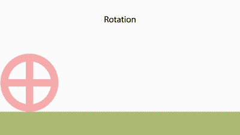

[Image Source](https://en.wikipedia.org/wiki/File:Rolling_animation.gif)

## Vectors

### Vectors

[Vector Video](https://www.youtube.com/watch?v=fNk_zzaMoSs)

A vector is a list of numbers of some arbitrary number of dimensions, that represents a **direction** with some **magnitude** in a coordinate space.

You can think of them as arrows in some n-dimensional coordinate space. Or the points defined by those arrows.

So, for example, a 3D vector moving from the origin (O) to some point (P) can be denoted:
$$
\vec{v} = \vec{OP} = \begin{bmatrix} 2\\3\\5 \end{bmatrix}
\\ \text{Point } O \text{ to } \text{point } P
$$
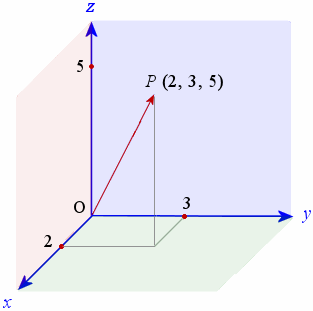

[Image Source](https://www.intmath.com/vectors/7-vectors-in-3d-space.php)

Vectors can generalise up to any arbitrary number of dimensions! It's just that when we're explaining them, it is a lot more intuitive to think of 2D or 3D vectors.

### Scalars

Scalars are contrasted from vectors by having magnitude but no direction.

They are just numbers! And numbers that **scale** vectors if multiplied with them!

### Basic Operations

#### **Addition**

You can add vectors by joining the heads to tails 

> $$
> \begin{align*}
>   \begin{bmatrix} a_1\\a_2\\a_3 \end{bmatrix}
> + \begin{bmatrix} b_1\\b_2\\b_3 \end{bmatrix}
> 
> &= \begin{bmatrix} a_1 + b_1\\a_2 + b_2\\a_3 + b_3\end{bmatrix}
> \end{align*}
> $$
>
> 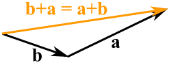
>
> [Image Source](https://www.mathsisfun.com/algebra/vectors.html)

>  Furthermore, addition is **commutative**
> $$
> \vec{a} + \vec{b} = \vec{b} + \vec{a}
> $$
> 

#### **Subtraction**

Subtraction works the same way.

> $$
> \begin{align*}
>   \begin{bmatrix} a_1\\a_2\\a_3 \end{bmatrix}
> - \begin{bmatrix} b_1\\b_2\\b_3 \end{bmatrix}
> 
> &= \begin{bmatrix} a_1 - b_1\\a_2 - b_2\\a_3 - b_3\end{bmatrix}
> \end{align*}
> $$
>
> 
>
> 
>
> [Image Source](https://www.mathsisfun.com/algebra/vectors.html)
>
> 

#### **Scalar Multiplication**

Vectors can be multiplied/scaled by numbers! That is why they are called **scalars**.
$$
\begin{align*}
  a \begin{bmatrix} x\\y\\z \end{bmatrix}

&= \begin{bmatrix} ax\\ay\\az\end{bmatrix} , \text{ for all scalar } a
\end{align*}
$$
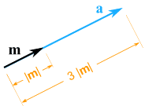

[Image Source](https://www.mathsisfun.com/algebra/vectors.html)

### Linear Combination

[Source](https://stattrek.com/statistics/dictionary.aspx?definition=linear_combination_of_vectors)

If you can add vectors together. And can also add multiples of them, you are doing a **linear combination** of the vectors.

That is, if one vector is equal to the sum of scalar multiples of other vectors, it is said to be a **linear combination** of the other vectors.

Example:
$$
\vec{a} = 2\vec{b} + 3\vec{c}
$$

### Vector Magnitude (Norm)

**Note**

This is only one conception of a vector norm. Specifically the **euclidean norm**. Other types of norms exist, but for now we'll not discuss them.

### Unit Vectors

A **unit vector** is a vector with magnitude 1.

To convert a vector into a unit vector, simply divide by its magnitude.
$$
\text{For the unit vector } \vec{u} \text { of vector } \vec{v} \text{:} \\
\vec{u} = \frac{\vec{v}}{\vert\vert\vec{v}\vert\vert}
$$
**Standard Unit Vectors**

There are also special unit vectors for the standard Cartesian coordinate system that denote directions in the axes! These are the standard unit vectors! And they **can be used to describe any vector you can define under this particular the coordinate system**.

We'll look at the 3D ones, but these generalise all the way up.

[Image Source](http://mathonline.wikidot.com/standard-unit-vectors)
$$
\vec{i} = \begin{bmatrix} 1\\0\\0 \end{bmatrix} , \;
\vec{j} = \begin{bmatrix} 0\\1\\0 \end{bmatrix} , \;
\vec{k} = \begin{bmatrix} 0\\0\\1 \end{bmatrix}
$$
Consequently, you may describe a vector as a **linear combination** of these standard unit vectors!
$$
3\vec{i} + 2\vec{j} + \vec{k} = \begin{bmatrix} 3\\2\\1 \end{bmatrix}
$$

### WIP:Dot Product

### WIP: Cross Product

### Angles

#### **Between Vectors**

Derived from the dot product formula.
$$
\theta = \arccos(\frac{\vec{p} \cdot \vec{q}}{\vert\vert \vec{p} \vert\vert\ \cdot \vert\vert \vec{q} \vert\vert})
$$

#### **Direction Cosines**

The direction cosines of a vector are the cosines of the **angles** that are formed between the coordinate axes and the vector.

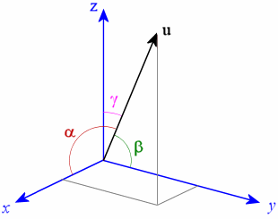

[Image Source](https://www.intmath.com/vectors/7-vectors-in-3d-space.php)

For 3D vectors:
$$
cos(\alpha) = \frac{u \cdot \vec{i}}{\vert\vert \vec{u} \vert\vert} = \frac{u_x}{\vert\vert \vec{u} \vert\vert} \\
cos(\beta) = \frac{u  \cdot \vec{j}}{\vert\vert \vec{u} \vert\vert} = \frac{u_y}{\vert\vert \vec{u} \vert\vert} \\
cos(\gamma) = \frac{u  \cdot \vec{k}}{\vert\vert \vec{u} \vert\vert} = \frac{u_z}{\vert\vert \vec{u} \vert\vert}
$$
It generalises upwards!

Furthermore, the sum of the squared cosines will be 1!
$$
cos^2(\alpha) + cos^2(\beta) + cos^2(\gamma) = 1
$$

### Basis Vectors

Interestingly enough, you can use **different vectors** to define a "unit vector" in a new coordinate system! These vectors will then be new **basis vectors** for your new coordinate system!

So take for instance:
$$
\vec{i} + \vec{j}
$$
But if we set our "unit vectors" as new ones, we end up with a completely new vector being defined!

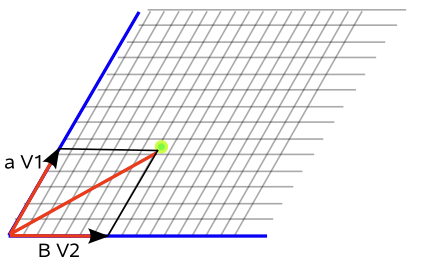

[Image Source](https://www.euclideanspace.com/maths/algebra/vectors/)
$$
\vec{i} = \begin{bmatrix} 7\\0 \end{bmatrix} , \;
\vec{j} = \begin{bmatrix} 3 \\ 5.25 \end{bmatrix}
$$
Then you can see... If we use these newly defined vectors, we get a new result because we've changed the **basis** for our coordinate system, creating a new vector space!
$$
\begin{align*}
\vec{i} + \vec{j} &= \begin{bmatrix} 7 + 3 \\  0 + 5.25 \end{bmatrix} \\
&= \begin{bmatrix} 10 \\  5.25 \end{bmatrix}
\end{align*}
$$
Essentially, setting these new basis vectors causes a **transformation** of all vectors from the original coordinate system (vector space) into another one! More on this in the matrices section...

### WIP: Span

### WIP: Linear Dependence and Independence

### WIP: Vector Spaces

- define new concept of norm under a particular vector space

### Vector Norms

#### **Definition**

More generally, a vector norm denotes some notion of **distance** for a vector. Note that this is **different from a distance metric**, which measures distance between two vectors.

> **Definition**
>
> 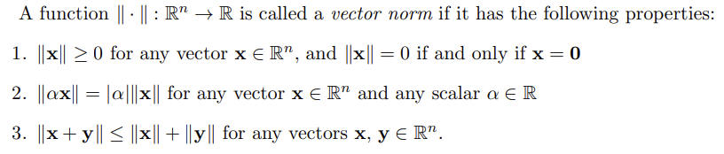
>
> [Source](https://www.math.usm.edu/lambers/mat610/sum10/lecture2.pdf)
>
> That is,
>
> 1. It is **non-zero and positive** for a **non-zero** vector
> 2. **Homogeneity**: It scales accordingly
> 3. And it fits the **triangle inequality**
>
> **Triangle inequality**: The sum of the length of any two sides of a triangle must be greater than or equal to the remaining side
>
> 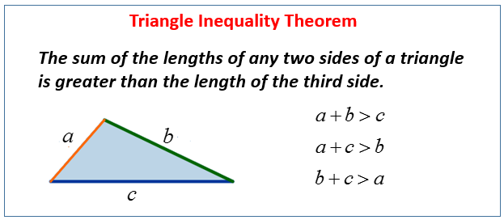
>
> [Image Source](https://www.onlinemathlearning.com/triangle-inequality.html)

#### **Absolute Value**

Only for one-dimensional vector spaces.
$$
\left\|x\right\|=\left|x\right|
$$

#### **p-Norms (Lp-norms)**

If x = f(t) is a function, then the p-norm is,
$$
\vert\vert{\bf x}\vert\vert_p=\left( \int \bigg\vert f(u)\bigg\vert^p\; dt \right)^{1/p},
\;\;\;\;\;\; 1\le p \le \infty
$$
But that really doesn't put it in intuitive terms.

So let's look at a few of these norms, for some p.

##### L0-norm

This is **not actually a norm** when you look at the definitions above. But it can be useful.

It is the **number of non-zero elements in a vector**.
$$
\vert\vert{\bf x}\vert\vert_0
$$
Example:
$$
\left\|{\begin{bmatrix} 1\\5\\6\\0 \end{bmatrix}}\right\|_0 = 3
$$

##### L1-norm (Taxicab Norm)

This is the **sum of all the (absolute) magnitudes in the vector**.
$$
\vert\vert{\bf x}\vert\vert _1=\sum_{i=1}^n \vert x_i\vert
$$

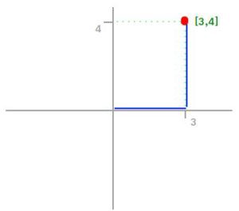

[Image Source](https://medium.com/@montjoile/l0-norm-l1-norm-l2-norm-l-infinity-norm-7a7d18a4f40c)

For example, in the above, the L1 distance is |3| + |4| = 7

##### L2-norm (Euclidean Norm)

This is the one you already know. Apply the generalised Pythagorean theorem.
$$
\vert\vert{\bf x}\vert\vert _2= \sqrt{x_1^2 + x_2^2 + \dots + x_n^2} = \sqrt{\bf x^T \cdot \bf x}
$$
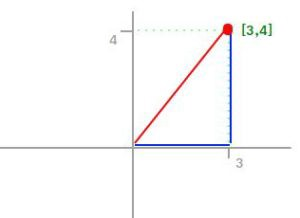

[Image Source](https://medium.com/@montjoile/l0-norm-l1-norm-l2-norm-l-infinity-norm-7a7d18a4f40c)

From the example:
$$
\vert\vert{\bf x}\vert\vert _2 = \sqrt{3^2 + 4^2} = \sqrt{25} = 5
$$

##### L∞-norm (Maximum Norm)

Also known as the infinity or supremum norm

The **maximum element** of the vector.
$$
{\displaystyle \left\|\mathbf {x} \right\|_{\infty } = \max _{i}\left|x_{i}\right|}
$$

### Metrics (Distance Functions)

#### **Definition**

Measure some notion of **distance** between two vectors!

> 
>
> [Image Source](https://www.cs.utah.edu/~jeffp/teaching/cs5955/L7-Distances.pdf)
>
> Notice that distance metrics **take in two arguments**! They are functions of pairs of vectors (or points, since vectors can represent points too!)

#### **L-metrics (Minowski Distances)**

> Generally:
> $$
> d_p({\bf x},{\bf y}) =
> \vert\vert{\bf x}-{\bf y}\vert\vert _p
> = (\sum_{i=1}^N \vert x_i-y_i\vert^p )^{1/p},\;\;\;\;(1\le p\le \infty)
> $$
> [Source](http://fourier.eng.hmc.edu/e161/lectures/algebra/node11.html)

But again, this is not so intuitive.

When we vary p, we get the different L metrics!

##### L0-metric

Again, not a proper distance metric. But still usable.

It is the **number of non-zero elements in the vector that represents the difference between the two input vectors**.

Example:
$$
\vec{p} = \begin{bmatrix} 1\\2\\3\\0 \end{bmatrix} , \;
\vec{q} = \begin{bmatrix} 3\\2\\1\\0 \end{bmatrix}

\\

d_0(\vec{p}, \vec{q}) = \vert\vert \vec{p} - \vec{q} \vert\vert_0 = \left\|{\begin{bmatrix} -2\\0\\2\\0 \end{bmatrix}}\right\|_0 = 2
$$

##### L1-metric (Manhattan Distance)

Also known as ctiy block distance or taxicab distance.

It is the sum of the differences of the individual elements of the vectors in question.
$$
d_1({\bf x},{\bf y})=\vert\vert{\bf x}-{\bf y}\vert\vert _1=\sum_{i=1}^N \vert x_i-y_i\vert
$$

[Image Source](https://www.101computing.net/manhattan-distance-calculator/)

Example:
$$
\vec{p} = \begin{bmatrix} 1\\2\\3\\0 \end{bmatrix} , \;
\vec{q} = \begin{bmatrix} 3\\2\\1\\0 \end{bmatrix}
\\

\begin{align*}
\\
d_1(\vec{p}, \vec{q}) &= \vert\vert \vec{p} - \vec{q} \vert\vert_1 \\ &
= |1-3| + |2-2| + |3-1| + |0-0| \\ &
= 4
\end{align*}
$$

##### L2-metric (Euclidean Distance)

Also known as straight distance or Pythagorean distance.

You should know this already.
$$
d_2({\bf x},{\bf y})=\vert\vert{\bf x}-{\bf y}\vert\vert _2=\sqrt{\sum_{i=1}^N \vert x_i-y_i\vert^2}
$$
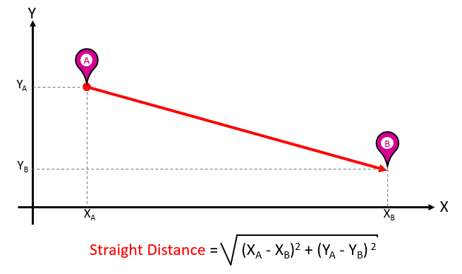

[Image Source](https://www.101computing.net/manhattan-distance-calculator/)

Example:
$$
\vec{p} = \begin{bmatrix} 1\\2\\3\\0 \end{bmatrix} , \;
\vec{q} = \begin{bmatrix} 3\\2\\1\\0 \end{bmatrix}
\\

\begin{align*}
\\
d_2(\vec{p}, \vec{q}) &= \vert\vert \vec{p} - \vec{q} \vert\vert_2 \\ &
= \sqrt{(1-3)^2 + (2-2)^2 + (3-1)^2 + (0-0)^2} \\ &
= \sqrt{4 + 0 + 4 + 0} \\ &
= \sqrt{8}
\end{align*}
$$

##### L∞-metric (Chebyshev Distance)

Also known as the maximum metric or chessboard distance.

This is the **maximum absolute distance** out of all the elements of the same index between the vectors being compared.

It's called chessboard distance because this is the maximum number of moves it takes for a king to travel between any two spaces in chess. (Since the king can move diagonally, the lesser of the two distances in the horizontal and vertical directions gets absorbed.)
$$
d_{\inf}(x,y) = \max_i(|x_i -y_i|)
$$
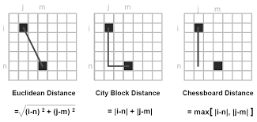

[Image Source](http://www.philadelphia.edu.jo/academics/hhardan/uploads/Image_Processing-ch3_part_1.pdf)

Example:
$$
\vec{p} = \begin{bmatrix} 5\\4\\3\\2 \end{bmatrix} , \;
\vec{q} = \begin{bmatrix} 0\\0\\0\\0 \end{bmatrix}
\\

\begin{align*}
\\
d_\infty(\vec{p}, \vec{q}) &= 5
\end{align*}
$$

##### Unit Circles for Varying p

When you draw a unit circle using the different distance metrics, this is what you get.

All points along the drawn circles are distance = 1 from the origin! But you notice that using different distance metrics yields different looking 'circles'!

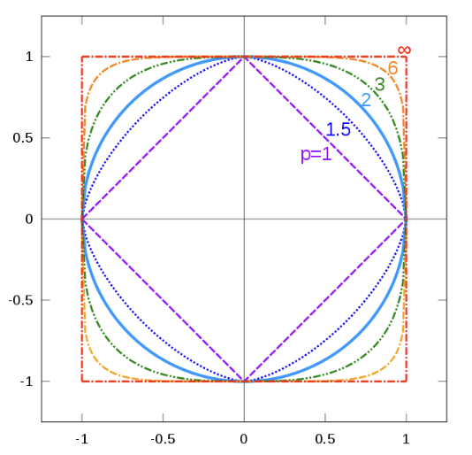

[Image Source](https://en.wikipedia.org/wiki/File:Vector-p-Norms_qtl1.svg)

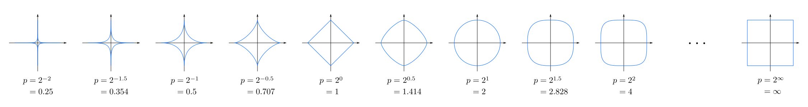

### WIP: Cosine Distance

[Source](https://www.cs.utah.edu/~jeffp/teaching/cs5955/L7-Distances.pdf)

Finding the **angular distance** between vectors!
$$

$$

**Note**

This is a *pseudometric* since you may have
$$
d_{cos}(\vec{x} , 2\vec{x}) = 0
$$
Even when the two vectors are different.

**Applications**

- Similarity metrics for machine learning.
- Locality sensitive hashing algorithms

#### **Edit Distance**

[Source](https://en.wikipedia.org/wiki/Edit_distance)

You can also generalise it a bit to just comparing elements! These are useful in string comparison or fuzzy search algorithms.

The question to ask is...

> How many **edits** do I need to go from one vector to another?

- The [Levenshtein distance](https://en.wikipedia.org/wiki/Levenshtein_distance) allows deletion, insertion and substitution.
- The [Longest common subsequence](https://en.wikipedia.org/wiki/Longest_common_subsequence) (LCS) distance allows only insertion and deletion, not substitution.
- The [Hamming distance](https://en.wikipedia.org/wiki/Hamming_distance) allows only substitution, hence, it only applies to strings of the same length.
- The [Damerau–Levenshtein distance](https://en.wikipedia.org/wiki/Damerau–Levenshtein_distance) allows insertion, deletion, substitution, and the [transposition](https://en.wikipedia.org/wiki/Transposition_(mathematics)) of two adjacent characters.
- The [Jaro distance](https://en.wikipedia.org/wiki/Jaro_distance) allows only [transposition](https://en.wikipedia.org/wiki/Transposition_(mathematics)).

Let's look at a couple to get the idea across.

**Hamming Distance**
$$
\vec{p} = \begin{bmatrix} 1\\2\\3\\0 \end{bmatrix} , \;
\vec{q} = \begin{bmatrix} 3\\2\\1\\0 \end{bmatrix}
\\

d_{Hamming} = 2
$$
We need to substitute 1 -> 3 and 3 -> 1 to obtain vector **q**!

**Levenshtein Distance**
$$
\vec{p} = \begin{bmatrix} 3\\2\\1 \end{bmatrix} , \;
\vec{q} = \begin{bmatrix} 3\\2\\1\\0 \end{bmatrix}
\\

d_{Levenshtein} = 1
$$
Just insert a 0!

So on and so forth.

Note that there are formal definitions, but getting the intuition behind it is more important.

## Matrices

### Matrix Definition

A matrix is a **rectangular array** of numbers with some dimension of rows and columns. (Of dimension m-by-n.)

For example, this is a 3-by-2 matrix. (row-by-columns)
$$
{\displaystyle \mathbf {A} ={\begin{bmatrix}a_{1,1}&a_{1,2}\\a_{2,1}&a_{2,2}\\a_{3,1}&a_{3,2}\end{bmatrix}}}
$$
A matrix can also be thought of as a collection of vectors!

### WIP: Basic Matrix Operations

## WIP: Tensors

# WIP: Vector Calculus

## WIP: Vector Fields

[https://en.wikipedia.org/wiki/Vector_field#:~:text=In%20vector%20calculus%20and%20physics,a%20point%20in%20the%20plane.](https://en.wikipedia.org/wiki/Vector_field#:~:text=In vector calculus and physics,a point in the plane.)

# Topology

## WIP: Manifolds

### WIP: Differentiable (Smooth) Manifolds

### WIP: Piece-wise Linear Manifolds

### WIP: Topological Manifolds

### WIP:Homeomorphisms

# WIP: Mathematical Analysis

## Some Definitions

### WIP: Supremum and Infimum

## WIP: Continuity and Smoothness

Definitions of continuity occur on a spectrum. Here, we go from least to most strict.

Which means that a stricter class implies membership in the more relaxed classes!

### WIP: Continuity

### WIP: Uniform Continuity

### WIP: Hölder Continuity

### WIP: Lipschitz Continuity

This creates a bound for the slope of the function!

Some practical significances, especially regarding knowing the Lipschitz constant:

- It can be a guarantee that your function will not proverbially explode after perturbing its input
- Lipschitz structures can 

### WIP: Continuously Differentiable (Smooth Functions)

https://math.stackexchange.com/questions/472148/smooth-functions-or-continuous

https://mathworld.wolfram.com/SmoothFunction.html

https://mathworld.wolfram.com/C-InfinityFunction.html

# Abstract Algebra

## WIP: Group Theory

### WIP: Groups

https://www.reddit.com/r/explainlikeimfive/comments/1oqqhw/eli5_seriously_like_im_5_what_are_rings_groups/

http://www-users.math.umn.edu/~brubaker/docs/152/152groups.pdf

### WIP: Rings

### WIP: Fields

---

[.png)](https://www.buymeacoffee.com/methylDragon)

[Or leave a tip! ヾ(°∇°*)](https://www.paypal.me/methylDragon)

