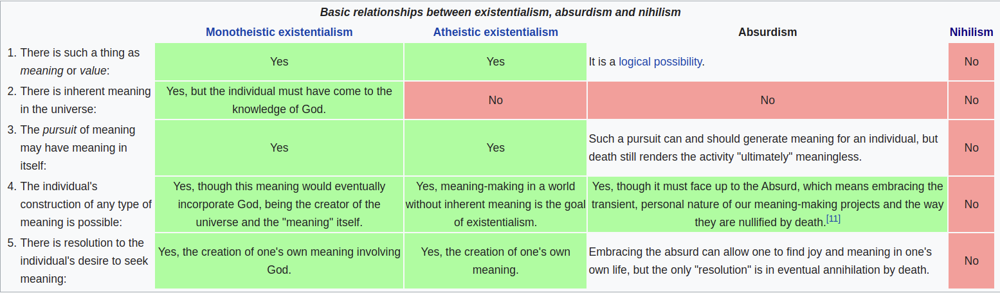

# Philosophy

> *noun*
>
> 1. The study of the fundamental nature of knowledge, reality, and existence, especially when considered as an academic discipline.
>
> [Source](https://www.lexico.com/en/definition/philosophy)

## Definitions

- Teleology
  - Relating to a thing's **purpose** rather than its **causes** or **effects**
  - e.g. A spoon's purpose is for scooping

## Existentialism

> You exist. You have no pre-ordained essence. Go make something of yourself, or don't. You are free.
>
> [Source](https://www.reddit.com/r/explainlikeimfive/comments/l0q01/eli5_existentialism/)

- "How should one make sense of a seemingly meaningless universe?"
- "From whence does (teleological) meaning for human life come from?"
- "Does such a thing as meaning exist?"
- "Can we create meaning, and if so, how?"

### Existential Dread/Angst

[Source](https://www.learnreligions.com/angst-dread-anxiety-and-anguish-249954)

The anxiety one feels when faced with the nature of human existence, and the responsibility and reality of the choices we make.

There are slightly differing perspectives, however:

- Søren Kierkegaard: Dread
  - Anxiety in human life.
  - "He believed that dread is built into us as a means for God to call us to make a commitment to a moral and spiritual way of life despite the void of meaninglessness before us."
- Martin Heidegger: Angst
  - "A reference point for the individual’s confrontation with the impossibility of finding meaning in a meaningless universe."
- Jean-Paul Sartre: Nausea and Anguish
  - "A person’s realization that the universe is not neatly ordered and rational but is instead highly contingent and unpredictable."
  - "He also used the word “anguish” to describe the realization that we humans have total freedom of choice in terms of what we can do. In this, there are no real constraints on us except those we choose to impose."

### Existence Precedes Essence

[Source](https://www.reddit.com/r/explainlikeimfive/comments/38035k/eli5_existence_before_essence/)

>  **Essence**
>
> "What defines who you are at the most fundamental, basic level."
>
> That is, what you would routinely choose to do, and the choices that form who you are as a person. The sum total of your actions.

So, when Jean-Paul Sartre stated that **Existence Precedes Essence**, he was saying that one must first exist before one has essence. Essence is predicated on one's existence, since you must first exist to have the chance to make choices.

The **implication** is that there is no essentialism when it comes to human nature. Existentialists hold that humans are not essentially good or bad at birth, nor do they have any sort of teleological (objective, cosmic) meaning.

Instead, humans are defined by the choices that they make in life. They can make their own meaning. And they can define themselves through their actions.

### The Absurd

The absurd is the conflict between the human tendency to seek value and meaning, and the human inability to find any in a purposeless, meaningless, or chaotic and irrational universe. [Source](https://liveideasjournal.org/2019/03/11/an-argument-for-the-absurd/)

A large swath of perspectives on human existence is pitched in the face of this conflict. The **Absurd** is the conflict between a seemingly purposeless and meaningless universe and the human urge to seek meaning within it.

[Image Source](https://en.wikipedia.org/wiki/Absurdism)

**Responses to The Absurd**

Once one has properly grasped the absurd, they have several options to either create meaning, or annihilate the conflict or need for meaning. (As proposed by Kierkegaard and Camus in their works,  *[The Sickness Unto Death](https://en.wikipedia.org/wiki/The_Sickness_Unto_Death)* (1849) and *[The Myth of Sisyphus](https://en.wikipedia.org/wiki/The_Myth_of_Sisyphus)* (1942), respectively.)

- Suicide
- **Monotheistic Existentialism**: Seeking meaning in religion, spiritualism, or abstract belief in some transcendent realm, being, or idea
  - Though this requires a [leap of faith](https://en.wikipedia.org/wiki/Leap_of_faith) into the empirically unprovable
  - Some treat this as "philosophical suicide"
- **Absurdism**: Accepting and living in spite of it. Rebel by trying to create meaning, even if it is ultimately futile.

### Existentialism

[Source](https://plato.stanford.edu/entries/existentialism/)

> Meaning is "**a consequence of engagement and commitment.**" 
>
> \- Sartre

Humans are not born with meaning. And a universal, objective, meaning for human life might or might not exist. Regardless, humans may define themselves through the actions that they take.

We create meaning for ourselves.

### Nihilism

[Source](https://plato.stanford.edu/entries/existentialism/)

>  "There is no justification for life, but also no reason not to live. Those who claim to find meaning in their lives are either dishonest or deluded. In either case, they fail to face up to the harsh reality of the human situations."
>
> ""Strut, fret, and delude ourselves as we may, our lives are of no significance, and it is futile to seek or to affirm meaning where none can be found.""
>
> \- Donald A. Crosby

Meaning and values do not exist in an objective sense. Meaning cannot be created like the existentialists purport.

We are insignificant, without purpose, and this is unlikely to change in the totality of existence.

### Absurdism

[Source](https://en.wikipedia.org/wiki/Absurdism)

There is no resolution to the Absurd. Any construction of meaning might have transient meaning, but it is ultimately nullified by death.

---

[.png)](https://www.buymeacoffee.com/methylDragon)

[Or leave a tip! ヾ(°∇°*)](https://www.paypal.me/methylDragon)

